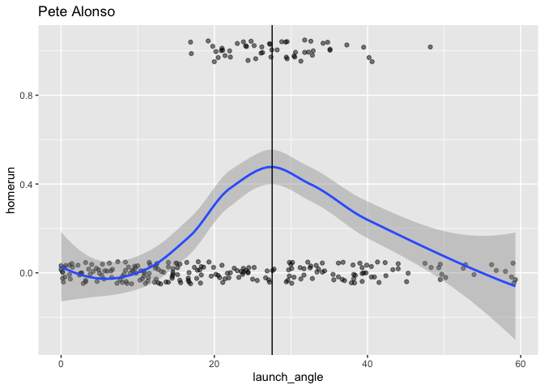
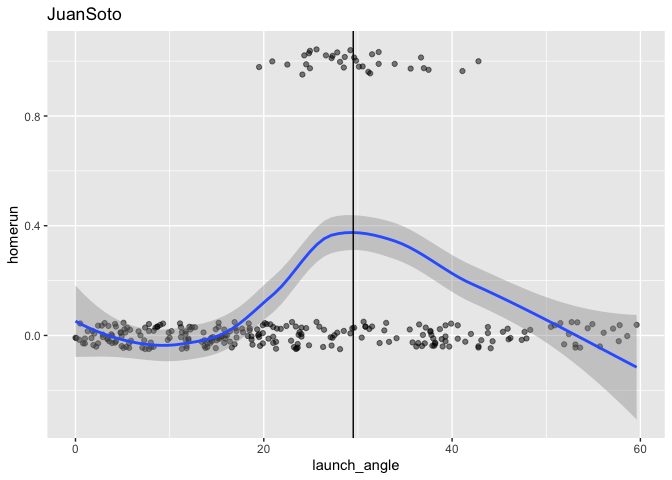
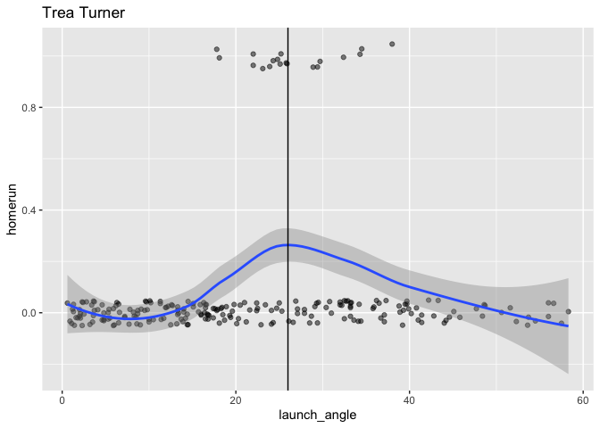
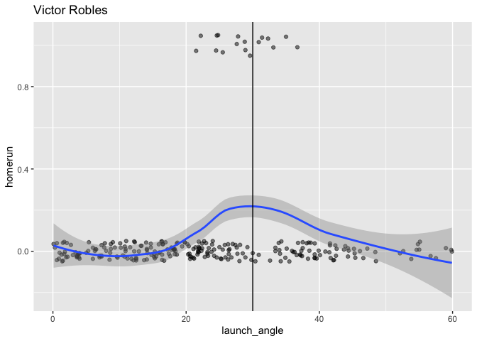

HR\_Probability\_Nationals
================

``` r
library(dplyr)
```

    ## 
    ## Attaching package: 'dplyr'

    ## The following objects are masked from 'package:stats':
    ## 
    ##     filter, lag

    ## The following objects are masked from 'package:base':
    ## 
    ##     intersect, setdiff, setequal, union

``` r
library(ggplot2)
library(broom)
```

``` r
#Importing CSV of Baseball Savant Data for ABs in 2019

PeteAlonso <- read.csv("PeteAlonso.csv", header = T)
JuanSoto <- read.csv("JuanSoto.csv", header = T)
TreaTurner <- read.csv("TreaTurner.csv", header = T)
VictorRobles <- read.csv("VictorRobles.csv", header = T)
```

``` r
#Adding ESPN's Park Factor Value to the data based on stadium of at-bat
PeteAlonso$park_factor <- ifelse(PeteAlonso$home_team == "COL", 1.394, 
       ifelse(PeteAlonso$home_team == "TEX", 1.245,
              ifelse(PeteAlonso$home_team == "DET", 1.107,
                     ifelse(PeteAlonso$home_team == "WSH", 1.101,
                            ifelse(PeteAlonso$home_team == "BAL", 1.088,
                                   ifelse(PeteAlonso$home_team == "MIA", 1.087,
                                          ifelse(PeteAlonso$home_team == "HOU", 1.083,
        ifelse(PeteAlonso$home_team == "KC", 1.074,
               ifelse(PeteAlonso$home_team == "BOS", 1.063,
                      ifelse(PeteAlonso$home_team == "PHI", 1.047,
                             ifelse(PeteAlonso$home_team == "CIN", 1.038,
                                    ifelse(PeteAlonso$home_team == "TOR", 1.031,
                                           ifelse(PeteAlonso$home_team == "LAA", 1.018,
        ifelse(PeteAlonso$home_team == "PIT", 1.004,
               ifelse(PeteAlonso$home_team == "ATL", 1.003,
                   ifelse(PeteAlonso$home_team == "ARI", 0.977,  
                          ifelse(PeteAlonso$home_team == "MIL", 0.976,
                                 ifelse(PeteAlonso$home_team == "MIN", 0.975,
                                        ifelse(PeteAlonso$home_team == "CLE", 0.972,
        ifelse(PeteAlonso$home_team == "CWS", 0.966,
               ifelse(PeteAlonso$home_team == "SEA", 0.952,
                      ifelse(PeteAlonso$home_team == "CHC", 0.931,
                             ifelse(PeteAlonso$home_team == "STL", 0.917,
                                    ifelse(PeteAlonso$home_team == "LAD", 0.905,
                                           ifelse(PeteAlonso$home_team == "TB", 0.895,
        ifelse(PeteAlonso$home_team == "NYM", 0.891,
               ifelse(PeteAlonso$home_team == "OAK", 0.887,
                      ifelse(PeteAlonso$home_team == "SD", 0.860,
                             ifelse(PeteAlonso$home_team == "NYY", 0.816,
                                    ifelse(PeteAlonso$home_team == "SF", 0.798,
              0.00))))))))))))))))))))))))))))))

JuanSoto$park_factor <- ifelse(JuanSoto$home_team == "COL", 1.394, 
       ifelse(JuanSoto$home_team == "TEX", 1.245,
              ifelse(JuanSoto$home_team == "DET", 1.107,
                     ifelse(JuanSoto$home_team == "WSH", 1.101,
                            ifelse(JuanSoto$home_team == "BAL", 1.088,
                                   ifelse(JuanSoto$home_team == "MIA", 1.087,
                                          ifelse(JuanSoto$home_team == "HOU", 1.083,
        ifelse(JuanSoto$home_team == "KC", 1.074,
               ifelse(JuanSoto$home_team == "BOS", 1.063,
                      ifelse(JuanSoto$home_team == "PHI", 1.047,
                             ifelse(JuanSoto$home_team == "CIN", 1.038,
                                    ifelse(JuanSoto$home_team == "TOR", 1.031,
                                           ifelse(JuanSoto$home_team == "LAA", 1.018,
        ifelse(JuanSoto$home_team == "PIT", 1.004,
               ifelse(JuanSoto$home_team == "ATL", 1.003,
                   ifelse(JuanSoto$home_team == "ARI", 0.977,  
                          ifelse(JuanSoto$home_team == "MIL", 0.976,
                                 ifelse(JuanSoto$home_team == "MIN", 0.975,
                                        ifelse(JuanSoto$home_team == "CLE", 0.972,
        ifelse(JuanSoto$home_team == "CWS", 0.966,
               ifelse(JuanSoto$home_team == "SEA", 0.952,
                      ifelse(JuanSoto$home_team == "CHC", 0.931,
                             ifelse(JuanSoto$home_team == "STL", 0.917,
                                    ifelse(JuanSoto$home_team == "LAD", 0.905,
                                           ifelse(JuanSoto$home_team == "TB", 0.895,
        ifelse(JuanSoto$home_team == "NYM", 0.891,
               ifelse(JuanSoto$home_team == "OAK", 0.887,
                      ifelse(JuanSoto$home_team == "SD", 0.860,
                             ifelse(JuanSoto$home_team == "NYY", 0.816,
                                    ifelse(JuanSoto$home_team == "SF", 0.798,
              0.00))))))))))))))))))))))))))))))

TreaTurner$park_factor <- ifelse(TreaTurner$home_team == "COL", 1.394, 
       ifelse(TreaTurner$home_team == "TEX", 1.245,
              ifelse(TreaTurner$home_team == "DET", 1.107,
                     ifelse(TreaTurner$home_team == "WSH", 1.101,
                            ifelse(TreaTurner$home_team == "BAL", 1.088,
                                   ifelse(TreaTurner$home_team == "MIA", 1.087,
                                      ifelse(TreaTurner$home_team == "HOU", 1.083,
        ifelse(TreaTurner$home_team == "KC", 1.074,
               ifelse(TreaTurner$home_team == "BOS", 1.063,
                      ifelse(TreaTurner$home_team == "PHI", 1.047,
                             ifelse(TreaTurner$home_team == "CIN", 1.038,
                                    ifelse(TreaTurner$home_team == "TOR", 1.031,
                                     ifelse(TreaTurner$home_team == "LAA", 1.018,
        ifelse(TreaTurner$home_team == "PIT", 1.004,
               ifelse(TreaTurner$home_team == "ATL", 1.003,
                   ifelse(TreaTurner$home_team == "ARI", 0.977,  
                          ifelse(TreaTurner$home_team == "MIL", 0.976,
                                 ifelse(TreaTurner$home_team == "MIN", 0.975,
                                      ifelse(TreaTurner$home_team == "CLE", 0.972,
        ifelse(TreaTurner$home_team == "CWS", 0.966,
               ifelse(TreaTurner$home_team == "SEA", 0.952,
                      ifelse(TreaTurner$home_team == "CHC", 0.931,
                             ifelse(TreaTurner$home_team == "STL", 0.917,
                                    ifelse(TreaTurner$home_team == "LAD", 0.905,
                                        ifelse(TreaTurner$home_team == "TB", 0.895,
        ifelse(TreaTurner$home_team == "NYM", 0.891,
               ifelse(TreaTurner$home_team == "OAK", 0.887,
                      ifelse(TreaTurner$home_team == "SD", 0.860,
                             ifelse(TreaTurner$home_team == "NYY", 0.816,
                                    ifelse(TreaTurner$home_team == "SF", 0.798,
              0.00))))))))))))))))))))))))))))))

VictorRobles$park_factor <- ifelse(VictorRobles$home_team == "COL", 1.394, 
       ifelse(VictorRobles$home_team == "TEX", 1.245,
              ifelse(VictorRobles$home_team == "DET", 1.107,
                     ifelse(VictorRobles$home_team == "WSH", 1.101,
                            ifelse(VictorRobles$home_team == "BAL", 1.088,
                                   ifelse(VictorRobles$home_team == "MIA", 1.087,
                                      ifelse(VictorRobles$home_team == "HOU", 1.083,
        ifelse(VictorRobles$home_team == "KC", 1.074,
               ifelse(VictorRobles$home_team == "BOS", 1.063,
                      ifelse(VictorRobles$home_team == "PHI", 1.047,
                             ifelse(VictorRobles$home_team == "CIN", 1.038,
                                    ifelse(VictorRobles$home_team == "TOR", 1.031,
                                     ifelse(VictorRobles$home_team == "LAA", 1.018,
        ifelse(VictorRobles$home_team == "PIT", 1.004,
               ifelse(VictorRobles$home_team == "ATL", 1.003,
                   ifelse(VictorRobles$home_team == "ARI", 0.977,  
                          ifelse(VictorRobles$home_team == "MIL", 0.976,
                                 ifelse(VictorRobles$home_team == "MIN", 0.975,
                                      ifelse(VictorRobles$home_team == "CLE", 0.972,
        ifelse(VictorRobles$home_team == "CWS", 0.966,
               ifelse(VictorRobles$home_team == "SEA", 0.952,
                      ifelse(VictorRobles$home_team == "CHC", 0.931,
                             ifelse(VictorRobles$home_team == "STL", 0.917,
                                    ifelse(VictorRobles$home_team == "LAD", 0.905,
                                        ifelse(VictorRobles$home_team == "TB", 0.895,
        ifelse(VictorRobles$home_team == "NYM", 0.891,
               ifelse(VictorRobles$home_team == "OAK", 0.887,
                      ifelse(VictorRobles$home_team == "SD", 0.860,
                             ifelse(VictorRobles$home_team == "NYY", 0.816,
                                    ifelse(VictorRobles$home_team == "SF", 0.798,
              0.00))))))))))))))))))))))))))))))

#Creating Dummy Homerun Variable
PeteAlonso$homerun <- ifelse(PeteAlonso$events == "home_run", 1, 0)
JuanSoto$homerun <- ifelse(JuanSoto$events == "home_run", 1, 0)
TreaTurner$homerun <- ifelse(TreaTurner$events == "home_run", 1, 0)
VictorRobles$homerun <- ifelse(VictorRobles$events == "home_run", 1, 0)
```

``` r
#Data formatting

#Replacing nulls with NA
PeteAlonso$launch_angle[PeteAlonso$launch_angle == "null"] <- NA
PeteAlonso$launch_speed[PeteAlonso$launch_speed == "null"] <- NA
PeteAlonso$effective_speed[PeteAlonso$effective_speed == "null"] <- NA
PeteAlonso$release_spin_rate[PeteAlonso$release_spin_rate == "null"] <- NA
PeteAlonso$hit_distance_sc[PeteAlonso$hit_distance_sc == "null"] <- NA

#changing structure for analysis
PeteAlonso$launch_angle <- as.numeric(as.character(PeteAlonso$launch_angle))
PeteAlonso$launch_speed <- as.numeric(as.character(PeteAlonso$launch_speed))
PeteAlonso$effective_speed <- as.numeric(as.character(PeteAlonso$effective_speed))
PeteAlonso$release_spin_rate <- as.numeric(as.character(PeteAlonso$release_spin_rate))
PeteAlonso$hit_distance_sc <- as.numeric(as.character(PeteAlonso$hit_distance_sc))
```

``` r
#Logistic Regression models
#Standard Logistic Regression Model
glm_Alonso <- glm(homerun ~ launch_angle + launch_speed + effective_speed +   release_spin_rate + park_factor, data = PeteAlonso, family = binomial, na.action = na.exclude)
summary(glm_Alonso)
```

    ## 
    ## Call:
    ## glm(formula = homerun ~ launch_angle + launch_speed + effective_speed + 
    ##     release_spin_rate + park_factor, family = binomial, data = PeteAlonso, 
    ##     na.action = na.exclude)
    ## 
    ## Deviance Residuals: 
    ##      Min        1Q    Median        3Q       Max  
    ## -2.16037  -0.24013  -0.03769  -0.00170   2.69147  
    ## 
    ## Coefficients:
    ##                     Estimate Std. Error z value Pr(>|z|)    
    ## (Intercept)       -3.446e+01  6.055e+00  -5.691 1.26e-08 ***
    ## launch_angle       1.113e-01  1.967e-02   5.660 1.52e-08 ***
    ## launch_speed       3.100e-01  4.456e-02   6.957 3.47e-12 ***
    ## effective_speed    1.341e-02  3.401e-02   0.394    0.693    
    ## release_spin_rate -2.131e-04  6.231e-04  -0.342    0.732    
    ## park_factor       -2.568e+00  1.931e+00  -1.330    0.184    
    ## ---
    ## Signif. codes:  0 '***' 0.001 '**' 0.01 '*' 0.05 '.' 0.1 ' ' 1
    ## 
    ## (Dispersion parameter for binomial family taken to be 1)
    ## 
    ##     Null deviance: 312.60  on 398  degrees of freedom
    ## Residual deviance: 146.23  on 393  degrees of freedom
    ##   (193 observations deleted due to missingness)
    ## AIC: 158.23
    ## 
    ## Number of Fisher Scoring iterations: 8

``` r
#Improved Model using polynomial fitting for launch angle
#Some regressors aren't statisticall significant but I chose to keep them anyways
glm_Alonso2 <- glm(homerun ~ poly(launch_angle, 2, raw=TRUE) + launch_speed + effective_speed:release_spin_rate + park_factor, data = PeteAlonso, family = binomial, na.action = na.exclude)
```

    ## Warning: glm.fit: fitted probabilities numerically 0 or 1 occurred

``` r
summary(glm_Alonso2)
```

    ## 
    ## Call:
    ## glm(formula = homerun ~ poly(launch_angle, 2, raw = TRUE) + launch_speed + 
    ##     effective_speed:release_spin_rate + park_factor, family = binomial, 
    ##     data = PeteAlonso, na.action = na.exclude)
    ## 
    ## Deviance Residuals: 
    ##      Min        1Q    Median        3Q       Max  
    ## -2.06091  -0.01039   0.00000   0.00000   2.64852  
    ## 
    ## Coefficients:
    ##                                      Estimate Std. Error z value Pr(>|z|)    
    ## (Intercept)                        -7.051e+01  1.342e+01  -5.255 1.48e-07 ***
    ## poly(launch_angle, 2, raw = TRUE)1  1.858e+00  3.896e-01   4.770 1.84e-06 ***
    ## poly(launch_angle, 2, raw = TRUE)2 -2.992e-02  6.466e-03  -4.627 3.70e-06 ***
    ## launch_speed                        4.459e-01  8.138e-02   5.479 4.29e-08 ***
    ## park_factor                        -4.152e+00  3.079e+00  -1.349    0.177    
    ## effective_speed:release_spin_rate   8.735e-06  9.974e-06   0.876    0.381    
    ## ---
    ## Signif. codes:  0 '***' 0.001 '**' 0.01 '*' 0.05 '.' 0.1 ' ' 1
    ## 
    ## (Dispersion parameter for binomial family taken to be 1)
    ## 
    ##     Null deviance: 312.605  on 398  degrees of freedom
    ## Residual deviance:  62.472  on 393  degrees of freedom
    ##   (193 observations deleted due to missingness)
    ## AIC: 74.472
    ## 
    ## Number of Fisher Scoring iterations: 12

``` r
#Same model but with distance
glm_Alonso3 <- lm(hit_distance_sc ~ poly(launch_angle,2,raw=TRUE) + launch_speed + effective_speed:release_spin_rate + park_factor, data = PeteAlonso, na.action = na.exclude)

summary(glm_Alonso3)
```

    ## 
    ## Call:
    ## lm(formula = hit_distance_sc ~ poly(launch_angle, 2, raw = TRUE) + 
    ##     launch_speed + effective_speed:release_spin_rate + park_factor, 
    ##     data = PeteAlonso, na.action = na.exclude)
    ## 
    ## Residuals:
    ##     Min      1Q  Median      3Q     Max 
    ## -373.94  -76.57    6.55   72.92  437.32 
    ## 
    ## Coefficients:
    ##                                      Estimate Std. Error t value Pr(>|t|)    
    ## (Intercept)                        -1.801e+02  6.641e+01  -2.712  0.00700 ** 
    ## poly(launch_angle, 2, raw = TRUE)1  4.192e+00  2.546e-01  16.466  < 2e-16 ***
    ## poly(launch_angle, 2, raw = TRUE)2 -1.622e-02  5.499e-03  -2.950  0.00338 ** 
    ## launch_speed                        2.946e+00  3.613e-01   8.156 5.81e-15 ***
    ## park_factor                         2.454e+01  4.861e+01   0.505  0.61391    
    ## effective_speed:release_spin_rate   1.890e-04  1.639e-04   1.153  0.24947    
    ## ---
    ## Signif. codes:  0 '***' 0.001 '**' 0.01 '*' 0.05 '.' 0.1 ' ' 1
    ## 
    ## Residual standard error: 99.16 on 361 degrees of freedom
    ##   (225 observations deleted due to missingness)
    ## Multiple R-squared:  0.5835, Adjusted R-squared:  0.5777 
    ## F-statistic: 101.1 on 5 and 361 DF,  p-value: < 2.2e-16

``` r
#Filtering middle launch angle values
PeteAlonso_middle <- PeteAlonso %>%
  filter(launch_angle >= 0, launch_angle  <= 60)

# scatterplot with jitter
data_space <- ggplot(data = PeteAlonso_middle, aes(y = homerun, x = launch_angle)) + 
      geom_jitter(width = 0, height = 0.05, alpha = 0.5) + ggtitle("Pete Alonso") 
#smooth curve
 data_space +
  geom_smooth() + geom_vline(xintercept = 27.55)
```

    ## `geom_smooth()` using method = 'loess' and formula 'y ~ x'

<!-- -->

``` r
#We see highest point on geom_smooth curve occurs about launch angle = 27.55 degrees
```

``` r
# create new data frame with predictive data
#Used Aaron Nola's 2019 averages (4seam Fb) and Alsonso's average EV
#Saying it's at Citi Field for park factor
new_pitch_Nola <- data.frame(launch_angle = 27.55, launch_speed = 94.7, effective_speed = 89.7, release_spin_rate = 2171, park_factor = 0.891)

# make predictions on probability of a homerun on the given pitch at optimal launch angle
augment(glm_Alonso2, newdata = new_pitch_Nola, type.predict = "response")
```

    ## # A tibble: 1 x 7
    ##   launch_angle launch_speed effective_speed release_spin_ra… park_factor .fitted
    ##          <dbl>        <dbl>           <dbl>            <dbl>       <dbl>   <dbl>
    ## 1         27.6         94.7            89.7             2171       0.891   0.143
    ## # … with 1 more variable: .se.fit <dbl>

``` r
# 0.1426

# make predictions on expected distance on the given pitch at optimal launch angle
augment(glm_Alonso3, newdata = new_pitch_Nola, type.predict = "response")
```

    ## # A tibble: 1 x 7
    ##   launch_angle launch_speed effective_speed release_spin_ra… park_factor .fitted
    ##          <dbl>        <dbl>           <dbl>            <dbl>       <dbl>   <dbl>
    ## 1         27.6         94.7            89.7             2171       0.891    261.
    ## # … with 1 more variable: .se.fit <dbl>

``` r
#260.76 feet
```

``` r
#Confusion Matrix to see accuracy
tidy.Alonso <- augment(glm_Alonso2, type.predict = "response") %>%
    mutate(homerun.hat = round(.fitted))
```

    ## Warning in augment_columns(x, data, newdata, type.predict = type.predict, : When
    ## fitting with na.exclude, rows with NA in original data will be dropped unless
    ## those rows are provided in 'data' argument

``` r
tidy.Alonso %>%
  select(homerun, homerun.hat) %>%
  table()
```

    ##        homerun.hat
    ## homerun   0   1
    ##       0 342   4
    ##       1   5  48

``` r
#Data formatting

#Replacing nulls with NA
JuanSoto$launch_angle[JuanSoto$launch_angle == "null"] <- NA
JuanSoto$launch_speed[JuanSoto$launch_speed == "null"] <- NA
JuanSoto$effective_speed[JuanSoto$effective_speed == "null"] <- NA
JuanSoto$release_spin_rate[JuanSoto$release_spin_rate == "null"] <- NA
JuanSoto$hit_distance_sc[JuanSoto$hit_distance_sc == "null"] <- NA

#changing structure for analysis
JuanSoto$launch_angle <- as.numeric(as.character(JuanSoto$launch_angle))
JuanSoto$launch_speed <- as.numeric(as.character(JuanSoto$launch_speed))
JuanSoto$effective_speed <- as.numeric(as.character(JuanSoto$effective_speed))
JuanSoto$release_spin_rate <- as.numeric(as.character(JuanSoto$release_spin_rate))
JuanSoto$hit_distance_sc <- as.numeric(as.character(JuanSoto$hit_distance_sc))
```

``` r
#Standard Logistic model 
glm_Soto <- glm(homerun ~ launch_angle + launch_speed + effective_speed +   release_spin_rate + park_factor, data = JuanSoto, family = binomial, na.action = na.exclude)
summary(glm_Soto)
```

    ## 
    ## Call:
    ## glm(formula = homerun ~ launch_angle + launch_speed + effective_speed + 
    ##     release_spin_rate + park_factor, family = binomial, data = JuanSoto, 
    ##     na.action = na.exclude)
    ## 
    ## Deviance Residuals: 
    ##      Min        1Q    Median        3Q       Max  
    ## -1.87714  -0.27851  -0.08008  -0.00292   2.40562  
    ## 
    ## Coefficients:
    ##                     Estimate Std. Error z value Pr(>|z|)    
    ## (Intercept)       -3.431e+01  7.366e+00  -4.658 3.19e-06 ***
    ## launch_angle       8.539e-02  1.750e-02   4.879 1.07e-06 ***
    ## launch_speed       3.281e-01  5.564e-02   5.896 3.72e-09 ***
    ## effective_speed   -5.088e-02  4.103e-02  -1.240    0.215    
    ## release_spin_rate -8.551e-04  7.809e-04  -1.095    0.273    
    ## park_factor        2.970e+00  2.404e+00   1.235    0.217    
    ## ---
    ## Signif. codes:  0 '***' 0.001 '**' 0.01 '*' 0.05 '.' 0.1 ' ' 1
    ## 
    ## (Dispersion parameter for binomial family taken to be 1)
    ## 
    ##     Null deviance: 233.53  on 404  degrees of freedom
    ## Residual deviance: 133.03  on 399  degrees of freedom
    ##   (140 observations deleted due to missingness)
    ## AIC: 145.03
    ## 
    ## Number of Fisher Scoring iterations: 8

``` r
#Improved Model using polynomial fitting for launch angle
#Some regressors aren't statisticall significant but I chose to keep them anyways
glm_Soto2 <- glm(homerun ~ poly(launch_angle, 2, raw=TRUE) + launch_speed + effective_speed:release_spin_rate + park_factor, data = JuanSoto, family = binomial, na.action = na.exclude)
```

    ## Warning: glm.fit: fitted probabilities numerically 0 or 1 occurred

``` r
summary(glm_Soto2)
```

    ## 
    ## Call:
    ## glm(formula = homerun ~ poly(launch_angle, 2, raw = TRUE) + launch_speed + 
    ##     effective_speed:release_spin_rate + park_factor, family = binomial, 
    ##     data = JuanSoto, na.action = na.exclude)
    ## 
    ## Deviance Residuals: 
    ##      Min        1Q    Median        3Q       Max  
    ## -2.32740  -0.02217  -0.00003   0.00000   2.39143  
    ## 
    ## Coefficients:
    ##                                      Estimate Std. Error z value Pr(>|z|)    
    ## (Intercept)                        -7.374e+01  1.539e+01  -4.791 1.66e-06 ***
    ## poly(launch_angle, 2, raw = TRUE)1  1.865e+00  4.681e-01   3.984 6.76e-05 ***
    ## poly(launch_angle, 2, raw = TRUE)2 -2.836e-02  7.488e-03  -3.788 0.000152 ***
    ## launch_speed                        4.456e-01  9.907e-02   4.498 6.85e-06 ***
    ## park_factor                         2.651e+00  2.901e+00   0.914 0.360761    
    ## effective_speed:release_spin_rate  -2.085e-05  1.383e-05  -1.508 0.131520    
    ## ---
    ## Signif. codes:  0 '***' 0.001 '**' 0.01 '*' 0.05 '.' 0.1 ' ' 1
    ## 
    ## (Dispersion parameter for binomial family taken to be 1)
    ## 
    ##     Null deviance: 233.534  on 404  degrees of freedom
    ## Residual deviance:  67.799  on 399  degrees of freedom
    ##   (140 observations deleted due to missingness)
    ## AIC: 79.799
    ## 
    ## Number of Fisher Scoring iterations: 12

``` r
#Same model but with distance
glm_Soto3 <- lm(hit_distance_sc ~ poly(launch_angle,2,raw=TRUE) + launch_speed + effective_speed:release_spin_rate + park_factor, data = JuanSoto, na.action = na.exclude)

summary(glm_Soto3)
```

    ## 
    ## Call:
    ## lm(formula = hit_distance_sc ~ poly(launch_angle, 2, raw = TRUE) + 
    ##     launch_speed + effective_speed:release_spin_rate + park_factor, 
    ##     data = JuanSoto, na.action = na.exclude)
    ## 
    ## Residuals:
    ##     Min      1Q  Median      3Q     Max 
    ## -387.48  -69.44    1.74   66.81  338.49 
    ## 
    ## Coefficients:
    ##                                      Estimate Std. Error t value Pr(>|t|)    
    ## (Intercept)                        -1.554e+02  6.674e+01  -2.329   0.0204 *  
    ## poly(launch_angle, 2, raw = TRUE)1  4.203e+00  2.540e-01  16.552  < 2e-16 ***
    ## poly(launch_angle, 2, raw = TRUE)2 -1.171e-02  5.570e-03  -2.102   0.0362 *  
    ## launch_speed                        2.221e+00  4.011e-01   5.538 5.78e-08 ***
    ## park_factor                         4.400e+01  4.689e+01   0.938   0.3487    
    ## effective_speed:release_spin_rate   2.717e-04  1.481e-04   1.835   0.0673 .  
    ## ---
    ## Signif. codes:  0 '***' 0.001 '**' 0.01 '*' 0.05 '.' 0.1 ' ' 1
    ## 
    ## Residual standard error: 88.94 on 373 degrees of freedom
    ##   (166 observations deleted due to missingness)
    ## Multiple R-squared:  0.6348, Adjusted R-squared:  0.6299 
    ## F-statistic: 129.7 on 5 and 373 DF,  p-value: < 2.2e-16

``` r
#Filtering middle launch angle values
JuanSoto_middle <- JuanSoto %>%
  filter(launch_angle >= 0, launch_angle  <= 60)

# scatterplot with jitter
data_space <- ggplot(data = JuanSoto_middle, aes(y = homerun, x = launch_angle)) + 
      geom_jitter(width = 0, height = 0.05, alpha = 0.5) + ggtitle("JuanSoto") 
#smooth curve
 data_space +
  geom_smooth() + geom_vline(xintercept = 29.5)
```

    ## `geom_smooth()` using method = 'loess' and formula 'y ~ x'

<!-- -->

``` r
 #We see highest point on geom_smooth curve occurs about launch angle = 29.5 degrees
```

``` r
# create new data frame with predictive data
#Used Aaron Nola's 2019 averages (4seam Fb) and Soto's average EV
#Assume game played at Nats Park
new_pitch_Nola <- data.frame(launch_angle = 29.5, launch_speed = 96, effective_speed = 89.7, release_spin_rate = 2171, park_factor = 1.101)

# make predictions on probability of a homerun on the given pitch at optimal launch angle
augment(glm_Soto2, newdata = new_pitch_Nola, type.predict = "response")
```

    ## # A tibble: 1 x 7
    ##   launch_angle launch_speed effective_speed release_spin_ra… park_factor .fitted
    ##          <dbl>        <dbl>           <dbl>            <dbl>       <dbl>   <dbl>
    ## 1         29.5           96            89.7             2171        1.10   0.145
    ## # … with 1 more variable: .se.fit <dbl>

``` r
# 0.145137

# make predictions on expected distance on the given pitch at optimal launch angle
augment(glm_Soto3, newdata = new_pitch_Nola, type.predict = "response")
```

    ## # A tibble: 1 x 7
    ##   launch_angle launch_speed effective_speed release_spin_ra… park_factor .fitted
    ##          <dbl>        <dbl>           <dbl>            <dbl>       <dbl>   <dbl>
    ## 1         29.5           96            89.7             2171        1.10    273.
    ## # … with 1 more variable: .se.fit <dbl>

``` r
#272.9573 feet
```

``` r
#Confusion Matrix
tidy.Soto <- augment(glm_Soto2, type.predict = "response") %>%
    mutate(homerun.hat = round(.fitted))
```

    ## Warning in augment_columns(x, data, newdata, type.predict = type.predict, : When
    ## fitting with na.exclude, rows with NA in original data will be dropped unless
    ## those rows are provided in 'data' argument

``` r
tidy.Soto %>%
  select(homerun, homerun.hat) %>%
  table()
```

    ##        homerun.hat
    ## homerun   0   1
    ##       0 366   5
    ##       1   9  25

``` r
#Data formatting

#Replacing nulls with NA
TreaTurner$launch_angle[TreaTurner$launch_angle == "null"] <- NA
TreaTurner$launch_speed[TreaTurner$launch_speed == "null"] <- NA
TreaTurner$effective_speed[TreaTurner$effective_speed == "null"] <- NA
TreaTurner$release_spin_rate[TreaTurner$release_spin_rate == "null"] <- NA
TreaTurner$hit_distance_sc[TreaTurner$hit_distance_sc == "null"] <- NA

#changing structure for analysis
TreaTurner$launch_angle <- as.numeric(as.character(TreaTurner$launch_angle))
TreaTurner$launch_speed <- as.numeric(as.character(TreaTurner$launch_speed))
TreaTurner$effective_speed <- as.numeric(as.character(TreaTurner$effective_speed))
TreaTurner$release_spin_rate <- as.numeric(as.character(TreaTurner$release_spin_rate))
TreaTurner$hit_distance_sc <- as.numeric(as.character(TreaTurner$hit_distance_sc))
```

``` r
#Logistic model 
glm_Turner <- glm(homerun ~ launch_angle + launch_speed + effective_speed +   release_spin_rate + park_factor, data = TreaTurner, family = binomial, na.action = na.exclude)
```

    ## Warning: glm.fit: fitted probabilities numerically 0 or 1 occurred

``` r
summary(glm_Turner)
```

    ## 
    ## Call:
    ## glm(formula = homerun ~ launch_angle + launch_speed + effective_speed + 
    ##     release_spin_rate + park_factor, family = binomial, data = TreaTurner, 
    ##     na.action = na.exclude)
    ## 
    ## Deviance Residuals: 
    ##     Min       1Q   Median       3Q      Max  
    ## -1.6079  -0.1363  -0.0195  -0.0006   3.3093  
    ## 
    ## Coefficients:
    ##                     Estimate Std. Error z value Pr(>|z|)    
    ## (Intercept)       -4.966e+01  1.221e+01  -4.068 4.74e-05 ***
    ## launch_angle       1.544e-01  3.513e-02   4.396 1.10e-05 ***
    ## launch_speed       4.483e-01  9.878e-02   4.538 5.67e-06 ***
    ## effective_speed   -6.368e-02  5.767e-02  -1.104    0.269    
    ## release_spin_rate  2.716e-04  1.139e-03   0.238    0.811    
    ## park_factor        3.052e+00  3.853e+00   0.792    0.428    
    ## ---
    ## Signif. codes:  0 '***' 0.001 '**' 0.01 '*' 0.05 '.' 0.1 ' ' 1
    ## 
    ## (Dispersion parameter for binomial family taken to be 1)
    ## 
    ##     Null deviance: 146.725  on 398  degrees of freedom
    ## Residual deviance:  80.055  on 393  degrees of freedom
    ##   (121 observations deleted due to missingness)
    ## AIC: 92.055
    ## 
    ## Number of Fisher Scoring iterations: 9

``` r
#Improved Model using polynomial fitting for launch angle
#Removed effective speed and spin on pitch because it was highly insignificant 
glm_Turner2 <- glm(homerun ~ poly(launch_angle, 2, raw=TRUE) + launch_speed + park_factor, data = TreaTurner, family = binomial, na.action = na.exclude)
```

    ## Warning: glm.fit: fitted probabilities numerically 0 or 1 occurred

``` r
summary(glm_Turner2)
```

    ## 
    ## Call:
    ## glm(formula = homerun ~ poly(launch_angle, 2, raw = TRUE) + launch_speed + 
    ##     park_factor, family = binomial, data = TreaTurner, na.action = na.exclude)
    ## 
    ## Deviance Residuals: 
    ##      Min        1Q    Median        3Q       Max  
    ## -1.56785  -0.00556  -0.00001   0.00000   3.09547  
    ## 
    ## Coefficients:
    ##                                      Estimate Std. Error z value Pr(>|z|)    
    ## (Intercept)                        -78.091654  18.221916  -4.286 1.82e-05 ***
    ## poly(launch_angle, 2, raw = TRUE)1   1.672569   0.496615   3.368 0.000757 ***
    ## poly(launch_angle, 2, raw = TRUE)2  -0.027725   0.009196  -3.015 0.002570 ** 
    ## launch_speed                         0.463191   0.120521   3.843 0.000121 ***
    ## park_factor                          6.136599   4.808889   1.276 0.201922    
    ## ---
    ## Signif. codes:  0 '***' 0.001 '**' 0.01 '*' 0.05 '.' 0.1 ' ' 1
    ## 
    ## (Dispersion parameter for binomial family taken to be 1)
    ## 
    ##     Null deviance: 153.545  on 406  degrees of freedom
    ## Residual deviance:  48.321  on 402  degrees of freedom
    ##   (113 observations deleted due to missingness)
    ## AIC: 58.321
    ## 
    ## Number of Fisher Scoring iterations: 13

``` r
#Same model but with distance
#Park factor highly insignificant 
glm_Turner3 <- lm(hit_distance_sc ~ poly(launch_angle,2,raw=TRUE) + launch_speed, data = TreaTurner, na.action = na.exclude)

summary(glm_Turner3)
```

    ## 
    ## Call:
    ## lm(formula = hit_distance_sc ~ poly(launch_angle, 2, raw = TRUE) + 
    ##     launch_speed, data = TreaTurner, na.action = na.exclude)
    ## 
    ## Residuals:
    ##     Min      1Q  Median      3Q     Max 
    ## -270.78  -75.61  -10.92   73.18  306.51 
    ## 
    ## Coefficients:
    ##                                     Estimate Std. Error t value Pr(>|t|)    
    ## (Intercept)                         9.782522  36.701337   0.267 0.789967    
    ## poly(launch_angle, 2, raw = TRUE)1  4.527696   0.217773  20.791  < 2e-16 ***
    ## poly(launch_angle, 2, raw = TRUE)2 -0.026721   0.005587  -4.783 2.49e-06 ***
    ## launch_speed                        1.428479   0.385243   3.708 0.000241 ***
    ## ---
    ## Signif. codes:  0 '***' 0.001 '**' 0.01 '*' 0.05 '.' 0.1 ' ' 1
    ## 
    ## Residual standard error: 90.58 on 374 degrees of freedom
    ##   (142 observations deleted due to missingness)
    ## Multiple R-squared:  0.5941, Adjusted R-squared:  0.5908 
    ## F-statistic: 182.5 on 3 and 374 DF,  p-value: < 2.2e-16

``` r
#Filtering middle launch angle values
TreaTurner_middle <- TreaTurner %>%
  filter(launch_angle >= 0, launch_angle  <= 60)

# scatterplot with jitter
data_space <- ggplot(data = TreaTurner_middle, aes(y = homerun, x = launch_angle)) + geom_jitter(width = 0, height = 0.05, alpha = 0.5) + 
  ggtitle("Trea Turner")
#smooth curve
 data_space +
  geom_smooth() + geom_vline(xintercept = 26)
```

    ## `geom_smooth()` using method = 'loess' and formula 'y ~ x'

<!-- -->

``` r
  #We see highest homerun probability at LA of about 26 degrees
```

``` r
# create new data frame with predictive data
#Used Aaron Nola's 2019 averages (4seam Fb) and Turner's average EV
#Assume game played at Nats Park
new_pitch_Nola <- data.frame(launch_angle = 26, launch_speed = 92.7, park_factor = 1.101)

# make predictions on probability of a homerun on the given pitch at optimal launch angle
augment(glm_Turner2, newdata = new_pitch_Nola, type.predict = "response")
```

    ## # A tibble: 1 x 5
    ##   launch_angle launch_speed park_factor .fitted .se.fit
    ##          <dbl>        <dbl>       <dbl>   <dbl>   <dbl>
    ## 1           26         92.7        1.10  0.0253  0.0286

``` r
# 0.02525

# make predictions on expected distance on the given pitch at optimal launch angle
augment(glm_Turner3, newdata = new_pitch_Nola, type.predict = "response")
```

    ## # A tibble: 1 x 5
    ##   launch_angle launch_speed park_factor .fitted .se.fit
    ##          <dbl>        <dbl>       <dbl>   <dbl>   <dbl>
    ## 1           26         92.7        1.10    242.    6.01

``` r
#241.8593 feet
```

``` r
#Confusion Matrix
tidy.Turner<- augment(glm_Turner2, type.predict = "response") %>%
    mutate(homerun.hat = round(.fitted))
```

    ## Warning in augment_columns(x, data, newdata, type.predict = type.predict, : When
    ## fitting with na.exclude, rows with NA in original data will be dropped unless
    ## those rows are provided in 'data' argument

``` r
tidy.Turner %>%
  select(homerun, homerun.hat) %>%
  table()
```

    ##        homerun.hat
    ## homerun   0   1
    ##       0 385   3
    ##       1   6  13

``` r
#Data formatting

#Replacing nulls with NA
VictorRobles$launch_angle[VictorRobles$launch_angle == "null"] <- NA
VictorRobles$launch_speed[VictorRobles$launch_speed == "null"] <- NA
VictorRobles$effective_speed[VictorRobles$effective_speed == "null"] <- NA
VictorRobles$release_spin_rate[VictorRobles$release_spin_rate == "null"] <- NA
VictorRobles$hit_distance_sc[VictorRobles$hit_distance_sc == "null"] <- NA

#changing structure for analysis
VictorRobles$launch_angle <- as.numeric(as.character(VictorRobles$launch_angle))
VictorRobles$launch_speed <- as.numeric(as.character(VictorRobles$launch_speed))
VictorRobles$effective_speed <- as.numeric(as.character(VictorRobles$effective_speed))
VictorRobles$release_spin_rate <- as.numeric(as.character(VictorRobles$release_spin_rate))
VictorRobles$hit_distance_sc <- as.numeric(as.character(VictorRobles$hit_distance_sc))
```

``` r
#Standard Logistic model 
glm_Robles <- glm(homerun ~ launch_angle + launch_speed + effective_speed +   release_spin_rate + park_factor, data = VictorRobles, family = binomial, na.action = na.exclude)
```

    ## Warning: glm.fit: fitted probabilities numerically 0 or 1 occurred

``` r
summary(glm_Robles)
```

    ## 
    ## Call:
    ## glm(formula = homerun ~ launch_angle + launch_speed + effective_speed + 
    ##     release_spin_rate + park_factor, family = binomial, data = VictorRobles, 
    ##     na.action = na.exclude)
    ## 
    ## Deviance Residuals: 
    ##      Min        1Q    Median        3Q       Max  
    ## -2.12045  -0.06850  -0.00483  -0.00009   3.05609  
    ## 
    ## Coefficients:
    ##                     Estimate Std. Error z value Pr(>|z|)    
    ## (Intercept)       -48.663363  13.685068  -3.556 0.000377 ***
    ## launch_angle        0.128965   0.035928   3.590 0.000331 ***
    ## launch_speed        0.462428   0.102312   4.520 6.19e-06 ***
    ## effective_speed    -0.064377   0.058562  -1.099 0.271639    
    ## release_spin_rate   0.002759   0.001564   1.764 0.077707 .  
    ## park_factor        -3.588427   4.132748  -0.868 0.385235    
    ## ---
    ## Signif. codes:  0 '***' 0.001 '**' 0.01 '*' 0.05 '.' 0.1 ' ' 1
    ## 
    ## (Dispersion parameter for binomial family taken to be 1)
    ## 
    ##     Null deviance: 140.734  on 400  degrees of freedom
    ## Residual deviance:  60.727  on 395  degrees of freedom
    ##   (149 observations deleted due to missingness)
    ## AIC: 72.727
    ## 
    ## Number of Fisher Scoring iterations: 10

``` r
#Improved Model using polynomial fitting for launch angle
#Some regressors aren't statisticall significant but I chose to keep them anyways
glm_Robles2 <- glm(homerun ~ poly(launch_angle, 2, raw=TRUE) + launch_speed + effective_speed:release_spin_rate + park_factor, data = VictorRobles, family = binomial, na.action = na.exclude)
```

    ## Warning: glm.fit: fitted probabilities numerically 0 or 1 occurred

``` r
summary(glm_Robles2)
```

    ## 
    ## Call:
    ## glm(formula = homerun ~ poly(launch_angle, 2, raw = TRUE) + launch_speed + 
    ##     effective_speed:release_spin_rate + park_factor, family = binomial, 
    ##     data = VictorRobles, na.action = na.exclude)
    ## 
    ## Deviance Residuals: 
    ##    Min      1Q  Median      3Q     Max  
    ## -1.975   0.000   0.000   0.000   1.901  
    ## 
    ## Coefficients:
    ##                                      Estimate Std. Error z value Pr(>|z|)  
    ## (Intercept)                        -2.673e+02  1.359e+02  -1.966   0.0493 *
    ## poly(launch_angle, 2, raw = TRUE)1  1.347e+01  7.665e+00   1.757   0.0788 .
    ## poly(launch_angle, 2, raw = TRUE)2 -2.231e-01  1.276e-01  -1.748   0.0804 .
    ## launch_speed                        1.306e+00  6.133e-01   2.129   0.0332 *
    ## park_factor                        -4.515e+01  2.545e+01  -1.774   0.0760 .
    ## effective_speed:release_spin_rate  -5.780e-05  7.733e-05  -0.747   0.4548  
    ## ---
    ## Signif. codes:  0 '***' 0.001 '**' 0.01 '*' 0.05 '.' 0.1 ' ' 1
    ## 
    ## (Dispersion parameter for binomial family taken to be 1)
    ## 
    ##     Null deviance: 140.734  on 400  degrees of freedom
    ## Residual deviance:  13.325  on 395  degrees of freedom
    ##   (149 observations deleted due to missingness)
    ## AIC: 25.325
    ## 
    ## Number of Fisher Scoring iterations: 17

``` r
#Same model but with distance
glm_Robles3 <- lm(hit_distance_sc ~ poly(launch_angle,2,raw=TRUE) + launch_speed + effective_speed:release_spin_rate + park_factor, data = VictorRobles, na.action = na.exclude)

summary(glm_Robles3)
```

    ## 
    ## Call:
    ## lm(formula = hit_distance_sc ~ poly(launch_angle, 2, raw = TRUE) + 
    ##     launch_speed + effective_speed:release_spin_rate + park_factor, 
    ##     data = VictorRobles, na.action = na.exclude)
    ## 
    ## Residuals:
    ##     Min      1Q  Median      3Q     Max 
    ## -414.03  -52.73    1.57   62.47  197.56 
    ## 
    ## Coefficients:
    ##                                      Estimate Std. Error t value Pr(>|t|)    
    ## (Intercept)                        -1.425e+02  6.838e+01  -2.084   0.0379 *  
    ## poly(launch_angle, 2, raw = TRUE)1  3.290e+00  1.908e-01  17.242   <2e-16 ***
    ## poly(launch_angle, 2, raw = TRUE)2 -9.489e-05  4.521e-03  -0.021   0.9833    
    ## launch_speed                        2.462e+00  2.621e-01   9.394   <2e-16 ***
    ## park_factor                         3.020e+01  4.707e+01   0.642   0.5216    
    ## effective_speed:release_spin_rate   1.820e-04  1.735e-04   1.049   0.2951    
    ## ---
    ## Signif. codes:  0 '***' 0.001 '**' 0.01 '*' 0.05 '.' 0.1 ' ' 1
    ## 
    ## Residual standard error: 81.14 on 348 degrees of freedom
    ##   (196 observations deleted due to missingness)
    ## Multiple R-squared:  0.6225, Adjusted R-squared:  0.6171 
    ## F-statistic: 114.8 on 5 and 348 DF,  p-value: < 2.2e-16

``` r
#Filtering middle launch angle values
VictorRobles_middle <- VictorRobles %>%
  filter(launch_angle >= 0, launch_angle  <= 60)

# scatterplot with jitter
data_space <- ggplot(data = VictorRobles_middle, aes(y = homerun, x = launch_angle)) +
      geom_jitter(width = 0, height = 0.05, alpha = 0.5) + ggtitle("Victor Robles") 
#smooth curve
 data_space +
  geom_smooth() + geom_vline(xintercept = 30)
```

    ## `geom_smooth()` using method = 'loess' and formula 'y ~ x'

<!-- -->

``` r
 #We see highest point on geom_smooth curve occurs about launch angle = 30 degrees
```

``` r
# create new data frame with predictive data
#Used Aaron Nola's 2019 averages (4seam Fb) and Robles's average EV
#Assume game played at Nats Park
new_pitch_Nola <- data.frame(launch_angle = 30, launch_speed = 80.3, effective_speed = 89.7, release_spin_rate = 2171, park_factor = 1.101)

# make predictions on probability of a homerun on the given pitch at optimal launch angle
augment(glm_Robles2, newdata = new_pitch_Nola, type.predict = "response")
```

    ## # A tibble: 1 x 7
    ##   launch_angle launch_speed effective_speed release_spin_ra… park_factor .fitted
    ##          <dbl>        <dbl>           <dbl>            <dbl>       <dbl>   <dbl>
    ## 1           30         80.3            89.7             2171        1.10 2.10e-9
    ## # … with 1 more variable: .se.fit <dbl>

``` r
# 2.104283e-09

# make predictions on expected distance on the given pitch at optimal launch angle
augment(glm_Robles3, newdata = new_pitch_Nola, type.predict = "response")
```

    ## # A tibble: 1 x 7
    ##   launch_angle launch_speed effective_speed release_spin_ra… park_factor .fitted
    ##          <dbl>        <dbl>           <dbl>            <dbl>       <dbl>   <dbl>
    ## 1           30         80.3            89.7             2171        1.10    222.
    ## # … with 1 more variable: .se.fit <dbl>

``` r
#222.46 feet
```

``` r
#Confusion Matrix
tidy.Robles <- augment(glm_Robles2, type.predict = "response") %>%
    mutate(homerun.hat = round(.fitted))
```

    ## Warning in augment_columns(x, data, newdata, type.predict = type.predict, : When
    ## fitting with na.exclude, rows with NA in original data will be dropped unless
    ## those rows are provided in 'data' argument

``` r
tidy.Robles %>%
  select(homerun, homerun.hat) %>%
  table()
```

    ##        homerun.hat
    ## homerun   0   1
    ##       0 383   1
    ##       1   2  15
